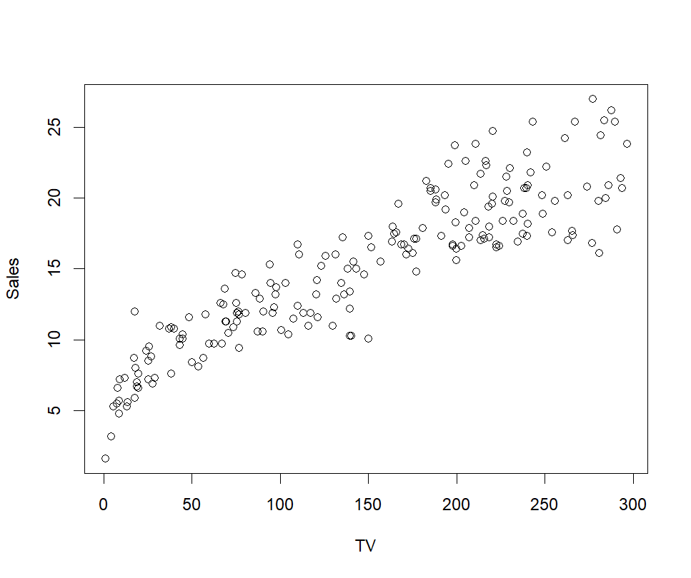
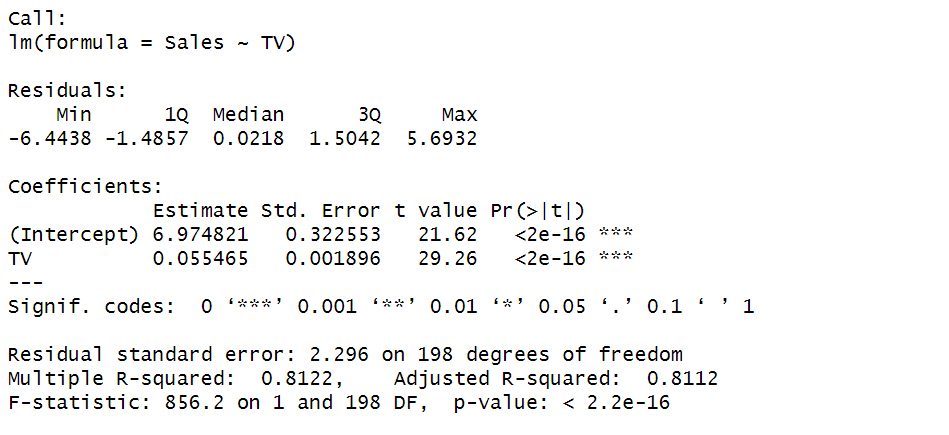

# linealregressionR
Linear regression analysis is a statistical method used to predict the value of a variable of study. The variable to predict is called the dependent variable and the variable used to predict the interest variable's value is called the independent variable. This program aims to show basic plotting tools for simple statistical linear regression problems in R, explaining how to understand the statistical values and a conclusion.

Something to consider: Dataset values are ussually taked as char 

## R Libraries

* **readr**: Provide a fast and friendly way to read rectangular data from delimited files, such as comma-separated values (CSV) and tab-separated values (TSV1). This library was used to load the information stored at advertising.csv file.
* **dplyr**: This library allows programmers to access to  constraining functions that allows make special selections over a dataframe, just like constrains in Database programming.
* **ggplot2**: Used for data visualization. The user provides a set of points to map variables to aesthetics, implememting graphical primitives it takes care of details such as interval, colors and so.

## Documentation links:

## Study Case: What advertising method is better?
A company has been investing in three advertising channels for a new product and, after the first trimester, they want to analyze
through an R statistical study what inversion has been relevant for sales increasing. Predict sales based on the money spent on different 
marketing plattforms.
- Dataset source: [advertising](https://www.kaggle.com/code/ashydv/sales-prediction-simple-linear-regression/notebook)

## Output

### TV vs Sales Study

<<<<<<< HEAD

=======

>>>>>>> 0f313a2678754fd4df0778429d79df729a5f4983
